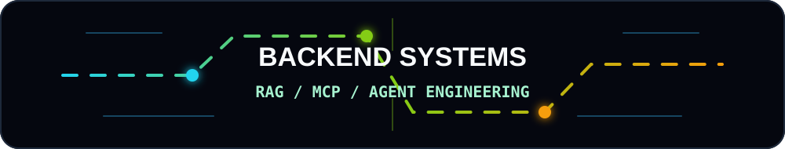
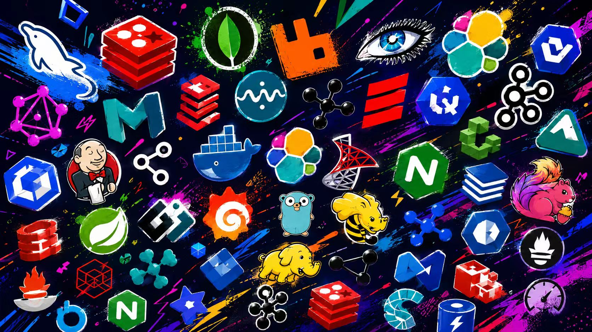
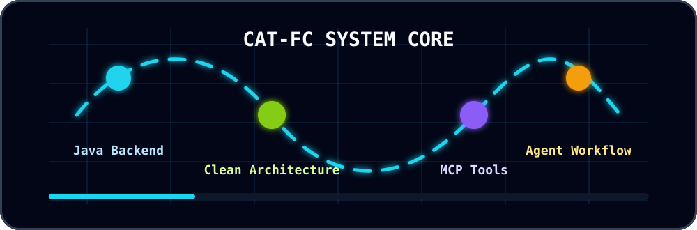
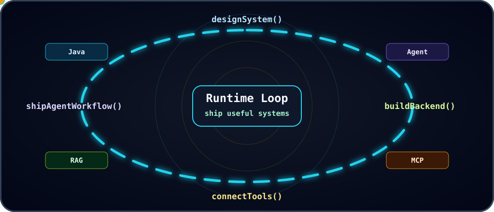
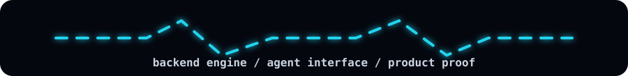

  

  

   

  
  
  

 

---

## System Core

  

I build backend-first systems and AI-native workflows that connect models with real data, tools, and production-facing processes.

---

## Tech Matrix

| Backend Core | Agent Engineering | Frontend Craft |
| --- | --- | --- |
|   |   |   |
|    |   |    |

 

---

## What I care about

- **Backend reliability:** API design, concurrency, cache, queue, data model, logs
- **RAG quality:** ingestion, chunking, retrieval, rerank, grounding, traceability
- **MCP integration:** tool definition, permission boundary, structured execution
- **Agent workflow:** planning, tool calling, memory, retry, human-in-the-loop
- **Frontend delivery:** when an idea needs a usable interface, ship it with TypeScript / Vue / React

---

## Project Radar

| Direction | Build Target |
| --- | --- |
| `rag-knowledge-base` | document parsing, vector retrieval, rerank, citations, answer pipeline |
| `mcp-tool-server` | expose databases, files, internal systems, and automation tools to agents |
| `java-service-kit` | Java backend template with auth, cache, queue, metrics, and CI |
| `agent-workflow-console` | planning, execution, tool-call logs, retry, and human review |
| `fullstack-devtools` | TypeScript frontend, backend APIs, and developer experience |

---

## Runtime Loop

  

---

  

   
   

  

