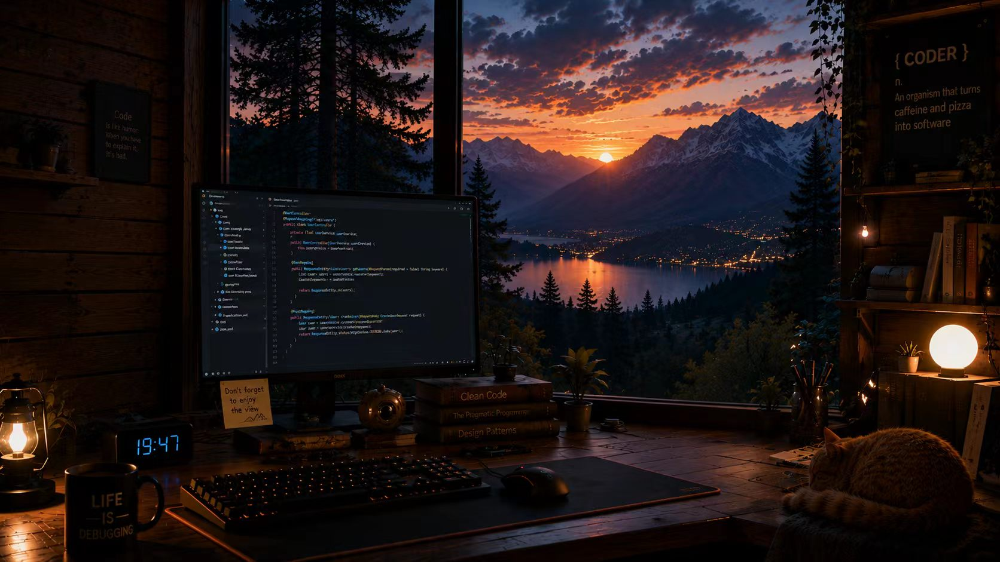

<div align="center">

  

  <br />
  <br />

  

  

  <br />

  
  
  

</div>

---

## `cat /proc/cat-fc`

```txt
role        Java Backend Developer
mode        Backend systems + Agent engineering
languages   Java | Python | C++ | C | Go
frontend    TypeScript | JavaScript | CSS | Vue | React
ai-stack    RAG | MCP | Agent | Tool Calling | Workflow
principle   Build clean. Debug deep. Ship useful.
```

我主要做后端开发，喜欢把复杂问题拆成稳定、清晰、能长期维护的系统。现在重点关注 **RAG、MCP、Agent** 方向，把模型能力接进真实数据、工具链和业务流程里。

---

## Tech Matrix

<div align="center">

| Backend Core | Agent Engineering | Frontend Craft |
| --- | --- | --- |
|   |   |   |
|    |   |    |

</div>

<br />


---

## Agent Runtime Blueprint


### What I care about

- **Backend reliability:** API design, concurrency, cache, queue, data model, logs
- **RAG quality:** ingestion, chunking, retrieval, rerank, grounding, traceability
- **MCP integration:** tool definition, permission boundary, structured execution
- **Agent workflow:** planning, tool calling, memory, retry, human-in-the-loop
- **Frontend delivery:** when an idea needs a usable interface, ship it with TypeScript / Vue / React

---

## Project Radar

| Direction | Build Target |
| --- | --- |
| `rag-knowledge-base` | 文档解析、向量检索、重排、引用溯源、问答链路 |
| `mcp-tool-server` | 给 Agent 暴露数据库、文件、内部系统和自动化工具 |
| `java-service-kit` | Java 后端模板：认证、缓存、队列、指标、CI |
| `agent-workflow-console` | 计划、执行、工具调用日志、失败重试和人工审核 |
| `fullstack-devtools` | TypeScript 前端 + 后端 API + 工程化体验 |

---

## Runtime Loop

```java
public final class CatFC {
    private final String[] backend = {"Java", "Python", "C++", "C", "Go"};
    private final String[] agent = {"RAG", "MCP", "Agent"};
    private final String[] frontend = {"TypeScript", "Vue", "React"};

    public void run() {
        while (true) {
            designSystem();
            buildBackend();
            connectTools();
            shipAgentWorkflow();
            improveDeveloperExperience();
        }
    }
}
```

---

<div align="center">

  

  <br />
  <br />

  

</div>
