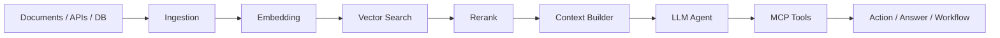

<div align="center">

  

  <h1>Hi, I'm Cat-FC</h1>

  

  <p>
    <strong>Backend-first developer</strong> building reliable services, AI-native workflows, and full-stack products.
  </p>

  <p>
    <a href="https://github.com/cat-fc">
      
    </a>
    
  </p>

</div>

---

## ./whoami

```txt
role        Java Backend Developer
focus       Backend Systems | RAG | MCP | Agent Development
languages   Java | Python | C++ | C | Go
frontend    TypeScript | JavaScript | CSS | Vue | React
mindset     Build clean. Debug deep. Ship useful.
```

I enjoy turning messy ideas into stable systems: APIs, services, workflows, tools, and AI applications that actually run in production-like environments.

---

## Tech Arsenal

<div align="center">

### Backend


### Agent Engineering


### Frontend


</div>

---

## Agent Development Map



I care about the engineering layer around AI:

- **RAG:** document ingestion, chunking, embedding, retrieval, rerank, answer trace
- **MCP:** tool servers, capability exposure, permission boundaries, structured actions
- **Agent:** planning, tool calling, memory, execution logs, human review
- **Backend:** APIs, service design, concurrency, caching, queues, observability

---

## Building Ideas

| Project Direction | What It Shows |
| --- | --- |
| **RAG Knowledge Base** | document parsing, vector retrieval, rerank, source-grounded answers |
| **MCP Tool Server** | tool protocol design, permissions, internal automation |
| **Java Service Template** | clean backend architecture, auth, cache, queue, metrics |
| **Agent Workflow Console** | planning, tool execution, logs, retries, human-in-the-loop |
| **Full-stack Dev Tools** | TypeScript UI, API integration, developer experience |

---

## GitHub Signals

<div align="center">

  
  

  <br />
  <br />

  

</div>

---

## Current Focus

```java
public class CurrentFocus {
    private final String backend = "Java systems with clean architecture";
    private final String ai = "RAG + MCP + Agent engineering";
    private final String frontend = "TypeScript, Vue, React";

    public void ship() {
        while (learning()) {
            buildUsefulThings();
            refactorUntilClear();
            documentWhatMatters();
        }
    }
}
```

---

<div align="center">

  <strong>Backend is the engine. Agent is the interface. Product is the proof.</strong>

  <br />
  <br />

  

</div>
